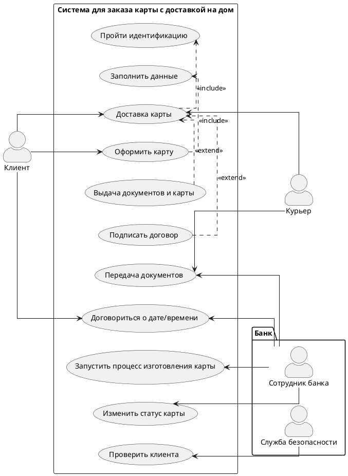

# **Бизнес функциональные требования   [Доставка карты клиенту курьером]** #

## **История изменений** ##

| **Дата** | **Описание изменения**| **Версия** | **Автор** | **Бизнес-заказчик** | **Согласование бизнес-заказчика** |
| :------: | -------------------------------|:-:| -------------- | ----------|--|
| 18.12.23 | Согласованная версия документа |1.0| Рамазанова Р.Р.| Еремчук Е.| <input type="checkbox"> Cогласовано |

## **Оглавление** ##
1. [Общая информация](#1)
2. [Бизнес цели и бизнес требования](#2)
3. [Функциональные требования](#3)
4. [Нефункциональные требования](#4)
5. [Критерии приёмки функционала](#5)
6. [Приложения](#6)

##  **1. Общая информация** ##
### **1.1.	Термины и определения** ###
| **Термин** | **Определение** |
| ------- | ----------|
| SA | Системный аналитик|

### **1.2. Ссылки на существующую документацию** ###
| **Описание** | **Ссылка** |
| :-----: | :-----------------------------------:|
| Диаграмма взаимодействия в нотации BPMN | [BPMN в формате draw.io](https://drive.google.com/file/d/1rNVh1SjmUJOzd9sYifRfnvZPZf4Z05O1/view?usp=sharing)|

### **1.3. Контактные лица** ###
| **Подразделение** | **Роль в процессе** | **Фамилия И.О.** |
| ------- | -------------------------------------| ----------|
| Отдел по работе с клиентами| Заказчик| Еремчук Е.|
| Команда разработки| SA | Рамазанова Р.Р.|

##  **2. Бизнес цели и бизнес требования** ##
Повышение количества новых клиентов и удержание существующих, используя процесс курьерской доставки.   В текущей системе отсутствует функциональность выбора способа доставки.

##  **3. Функциональные требования**
Интерфейс клиента: 
* Клиент должен иметь возможность оформить карту с курьерской доставкой.
* Клиент должен иметь возможность выбрать дату и время доставки.
Клиент должен иметь возможность изменить адрес доставки.
* Клиент должен иметь возможность изменить способ получения.
* Клиент должен получать автоматические уведомления (по SMS) о передаче документов курьеру.
* Клиент должен иметь возможность оставить обратную связь по оказанной услуге.

Интерфейс сотрудника:
* Система должна иметь возможность выгружать заявки в курьерскую службу.
* Система должна содержать подтверждение доставки.
*	Система должна предоставлять аналитические данные для получения информации об эффективности курьерской службы.

##  **4. Нефункциональные требования** ##
* Система должна обеспечивать защиту данных о заявках, включая персональную информацию клиентов и данные карт, а также использовать меры для предотвращения несанкционированного доступа и утечек информации.
* Система должна обеспечивать высокую скорость обработки заявок.
* Система должна обеспечивать интеграцию с другими системами, такими как система курьерской службы.
* Система должна предоставлять удобный и интуитивно понятный интерфейс для клиентов.
* Система должна быть адаптивной и совместимой с различными устройствами, такими как мобильные телефоны и планшеты.
* Необходимо обновить пользовательские инструкции, добавив информацию о возможности заказа карты с курьерской доставкой.

##  **5.	Критерии приёмки функционала** ## 
| **Номер критерия приемки**| **Описание сценария приемки**| **Ожидаемый результат** |
| -----|---------|-------|
|1. | Пользователь заходит на главную страницу сайта и нажимает кнопку «Оформить карту»| Система отображает форму для ввода данных|
|2. | Пользователь заполняет открывшуюся форму регистрации (ФИО, адрес регистрации и доставки, дата рождения, телефон, паспортные данные), выбирает способ доставки курьером и подтверждает операцию| Система выполняет проверку корректности заполнения данных и отправляет sms-сообщение с кодом подтверждения на введенный пользователем телефонный номер|
|3. | Пользователь вводит код из sms| Система выполняет проверку и отображает окно с информацией о принятии заявки в работу. Система отправляет sms об одобрении выпуска карты и звонке сотрудника банка по готовности карты|
|4. | Сотрудник банка связывается с клиентом и договаривается о дате и времени доставки и заносит эту информацию в систему| Дата доставки занесена в базу. Система делает выгрузку заявки во внешнюю курьерскую службу|
|5. | После доставки документов, сотрудник банка изменяет статус карты| Статус карты в системе изменен|

##  **6.	Приложения** ##

